# Supply Checkout SaaS: architecture

This is the target design for running Supply Checkout as a paid, multi-tenant product on AWS at $3 per user per month. Each choice is explained in an [architecture decision record](../adr/README.md); the diagrams below show how the pieces fit together. Sections marked planned or phase 2 aren't built yet; [What's built](#whats-built) lists what is.

## What's built

The design below is partly built. This table says which parts are on `main` today; everything else in this document is planned. Mobile apps and the second region (us-west-2) are phase 2.

| Component | Status | Where |
| --- | --- | --- |
| DynamoDB table, team-scoped data access, Stripe-link and webhook-idempotency helpers | Built | PRs #24, #26 |
| Alarm topics, journey alarms, dashboard, structured logging | Built | PR #30 |
| Route 53 zone, ACM certificates, SES domain identity | Built | PR #33 |
| Web hosting: S3, CloudFront, WAF, versioned releases (serves the demo today) | Built | PR #35 |
| Cognito user pool, `auth.` domain, web app client | Built | PR #36 |
| HTTP API with JWT authorizer, data Lambda for products and sheets, sign-in session routes | Built | PR #37 |
| Onboarding: `GET /me`, create a team, accept an invite | Built | PR #40 |
| Live updates: AppSync Events, subscribe authorizer, stream consumer with a dead-letter queue | Built | PR #41 |
| CI gates (lint, tests, cdk-nag synth, CodeQL, audit, secret scan) and release-please | Built | `.github/workflows/` |
| Runtime adapter: the web app on the AWS API (bead `a2b`) | Planned | |
| Atomic checkout, return and stock-adjust commands, stock history (bead `1dg.1`, [section 4](#4-checking-out-and-returning)) | Built | PR #49; the app switches to them with the adapter (`a2b`) |
| Sending invites, member removal | Planned | |
| Billing: Stripe Checkout, webhook, SQS worker, access rules (beads `x0l`, `2kl`, `qdx`) | Planned | |
| Receipt reading with Bedrock | Planned | |
| Synthetics canaries, automated deploys to staging and prod | Planned | |
| Faster cut-off of live updates for removed members (bead `4zn`) | Planned | |
| iOS and Android apps, us-west-2 | Phase 2 | |

## 1. System context

Who and what the product talks to.

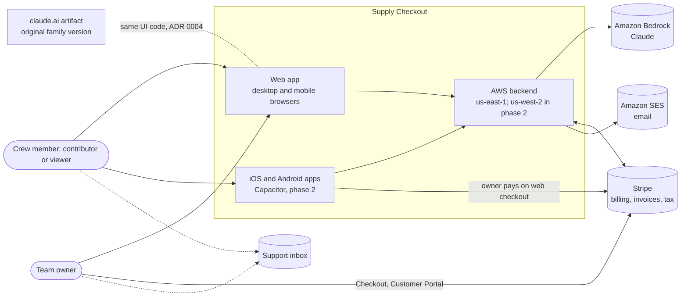

## 2. AWS deployment

The MVP runs in us-east-1 only. The stacks are region-ready, and us-west-2 is added in phase 2 to make the design active-active, with a home region for each team's writes ([ADR 0010](../adr/0010-multi-region-active-active.md)). Dashed boxes and lines are phase 2. In us-east-1, the web hosting, Cognito, the HTTP API with its data Lambda, AppSync Events with its stream consumer, and DynamoDB are built; the receipts and billing Lambdas, Bedrock and the Stripe queue are planned.

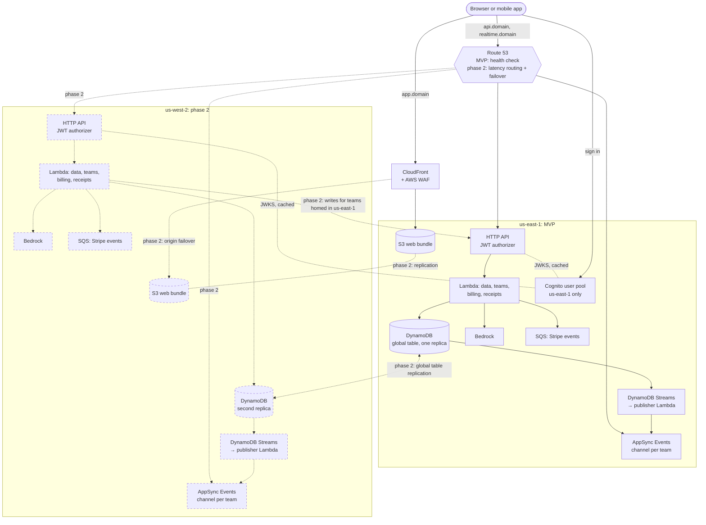

Not drawn: KMS keys, Secrets Manager (Stripe keys), SES, CloudWatch alarms and dashboards, AWS Backup. In the MVP they're in us-east-1. Phase 2 adds a KMS key, replica secrets, SES, and alarms and dashboards in us-west-2.

**Names.** Prod serves `supplycheckout.com` from the Route 53 zone the domain is delegated to; staging and dev serve `<env>.supplycheckout.com` from zones in their own accounts, delegated from prod's. The apex serves the demo at `/demo/` and redirects everything else to `app.` (until the landing page), `www.` redirects to the apex, `app.` serves the web app, `auth.` Cognito, `realtime.` AppSync Events and `api.` the HTTP API. The certificates for CloudFront, Cognito and AppSync are in us-east-1 (AWS requires it); `api.` has one in each region. SES signs with DKIM and uses `mail.` as its MAIL FROM domain, so both SPF and DKIM align for DMARC. See the README's "Domain and email" section.

**Web releases.** One CloudFront distribution serves the apex (the demo at `/demo/`, and a redirect to `app.` elsewhere), `www.` (a redirect to the apex) and `app.` from one S3 bucket in us-east-1, behind AWS WAF (a per-IP rate limit and AWS managed rules). Each build is uploaded once to `releases/<version>/`. A CloudFront Function reads the live version of the host's channel (`demo` or `app`) from a CloudFront KeyValueStore and rewrites the path into that release, so a release or rollback is one key write that takes effect within seconds. See the README's "Web hosting and releases" section.

## 3. Reading a receipt (planned)

The flow from [ADR 0008](../adr/0008-receipt-reading-bedrock.md). Nothing is saved until the user confirms, just like today.

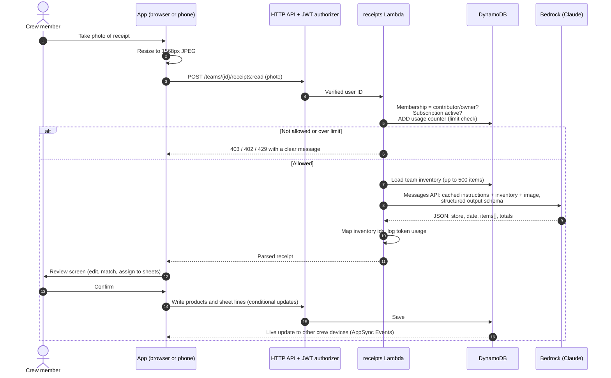

## 4. Checking out and returning

Built in bead `supply-checkout-1dg.1`; the web app switches to it with the runtime adapter (bead `a2b`). The artifact saves the sheet line and then changes stock in a second, separate read-then-write (`bumpStock` in `src/main.js`), so a retry or a double tap can take stock down twice and two people checking out the same line at once can lose a count. The commands make each checkout, return or stock adjustment one DynamoDB transaction with an operation ID, so a retry is safe. They sit next to the generic document routes, which the edit screens keep using. The claude.ai artifact build keeps its two-write path ([ADR 0004](../adr/0004-runtime-adapter.md)); the commands extend [ADR 0006](../adr/0006-api-and-realtime-sync.md). The client contract is [docs/api/commands.md](../api/commands.md); the code is `backend/src/data/commands.ts`.

```mermaid
sequenceDiagram
  autonumber
  actor U as Crew member
  participant App
  participant API as HTTP API + data Lambda
  participant DB as DynamoDB
  participant RT as Stream consumer and AppSync Events

  U->>App: Scan item, choose how many
  App->>App: New operation ID, kept until the call settles
  App->>API: POST /teams/{teamId}/sheets/{sheetId}/checkout:<br/>product key, quantity, operation ID
  API->>API: Verify JWT, check membership (contributor or owner),<br/>validate a whole-number quantity and any prices
  API->>DB: Read the operation record
  alt Operation ID already used (a retry)
    DB-->>API: The first call's result
    API-->>App: 200, replayed: the first result, nothing changed again
  else New operation ID
    API->>DB: Read the sheet and the product (strongly consistent)
    API->>API: Sheet open? Line new or existing?<br/>New line: copy code, name, price, cost from the product
    API->>DB: TransactWriteItems, all or nothing
    Note over API,DB: 1. Put the operation record, only if the ID is new<br/>2. Sheet: out = out + quantity (or add the new line), version + 1,<br/>only if the sheet is open and the line is as read<br/>3. Product: ADD stock minus the quantity if it tracks stock,<br/>else check it still doesn't; a new line also checks the product's version<br/>4. Put a movement record: product, sheet, change, reason, user, time, operation ID
    alt All four written
      DB-->>API: OK
      API->>DB: Read the sheet and product
      API-->>App: 200: the result, and the sheet and product as they are now
      DB-->>RT: Stream records for the sheet and product
      RT-->>App: Change notices to the team's other devices
    else Operation record exists (a concurrent retry got in first)
      DB-->>API: Canceled on the operation record, nothing written
      API-->>App: 200, replayed: the first result
    else Another write changed the line or product since the read
      DB-->>API: Canceled, nothing written
      API->>API: Read again and retry (up to 6 attempts)
    else A rule fails on the fresh read
      API-->>App: 400 (more returned than out, bad input), 404 (no sheet)<br/>or 409 (sheet closed, still busy after every retry)
    end
  end
  Note over App,API: After a timeout or a dropped connection the app<br/>retries with the same operation ID
```

- **Return** is the same transaction with `returned = returned + quantity` on the line, only while the returned total stays at or below `out` (the condition checks `out` against the target and `returned` against the value read), and stock going up by the quantity.
- **Stock adjust** (a receipt stock-in with its unit cost, or a count) has no sheet line: operation record, stock and movement record. A count sets stock from the level just read, so its movement's change is exact.
- The line's counts are added on the server (`SET out = out + :qty`; DynamoDB's `ADD` works only on top-level attributes, and a line is nested in the sheet's `items` map), never written as a value computed on the client, so concurrent checkouts on one line never lose a count. Stock uses `ADD`.
- Operation records (`OP#<operationId>`) keep the result for replay and expire after 7 days (the table's TTL). A retry with the same ID and a different request is refused.
- The movement records (`MOVE#<product key>#<time>#<operationId>`) are the inventory history: `GET /teams/{teamId}/products/{key}/movements` pages them newest first, and the nightly stock-drift check ([docs/journeys.md](../journeys.md), J4) reconciles stock against them ([how](../api/commands.md#reconciling-stock)).
- A closed sheet takes no checkouts or returns ([section 4a](#4a-sheet-states)); the server answers 409 and the person reopens it first.
- IAM: the data Lambda's per-team role has `UpdateItem` and `ConditionCheckItem` as well as `GetItem`, `PutItem`, `DeleteItem` and `Query`, all under the same `dynamodb:LeadingKeys` condition. Every item in a command's transaction is in the team's partition.

### 4a. Sheet states

As built in `src/main.js`. A sheet's `status` is `open` or `closed`; the app labels them "Checked out" and "Returned". Owners and contributors change it; viewers can't.

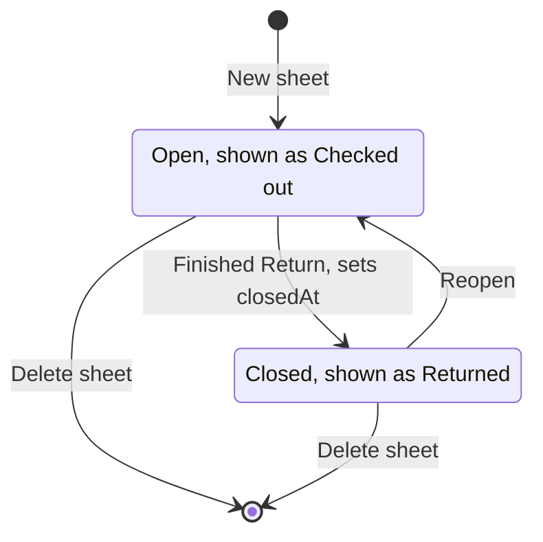

- A reopened sheet is simply `open` again; `closedAt` keeps the time it was last closed.
- Closing or reopening doesn't change stock. Only checkouts and returns do.
- A closed sheet hides the scan bar, so nothing new is checked out or returned on it. Owners and contributors can still correct a line's counts and price, edit the sheet's details, or delete it. The checkout and return commands (section 4) enforce this on the server: they refuse a closed sheet with 409, so a late return means reopening the sheet (or correcting the line, which doesn't move stock).

## 5. Live updates: authorization and revocation

As built in PR #41 ([ADR 0006](../adr/0006-api-and-realtime-sync.md)). The client contract, including reconnects and the polling fallback, is in [docs/api/realtime.md](../api/realtime.md). The web app doesn't use it yet; the runtime adapter (bead `a2b`) will.

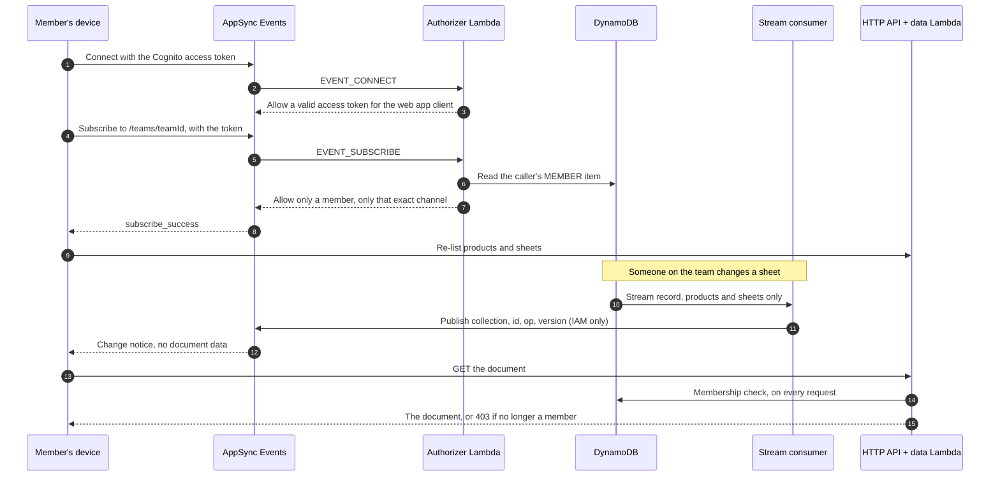

- **Connect and subscribe.** The authorizer allows a connection with a valid Cognito access token, and a subscription only to exactly `/teams/<teamId>` for a member of that team (any role), using the same membership check as the data API. Its answers aren't cached. Clients can't publish: the `teams` namespace takes publishes only from the stream consumer's IAM role, and the authorizer refuses publishes too.
- **Events are refetch hints.** Each carries a collection, an ID, an operation and a version, never document data. The app fetches the document from the data API, which reads the caller's `MEMBER` item on every request.
- **Revocation.** When a member is removed (or a team is canceled), their next fetch gets `403` at once and a new subscription is refused at once. AppSync Events can't end or filter a subscription that's already open, so that connection keeps receiving change notices (not contents) until it closes: in practice at the client's hourly reconnect on token refresh, and at most 24 hours. Cutting notices off within about a minute is bead `supply-checkout-4zn`; the options are in [docs/api/realtime.md](../api/realtime.md#cutting-off-notices-faster).
- **Missed events.** AppSync doesn't replay events, so the app re-lists both collections after every subscribe, when the tab becomes visible, and every 10 minutes. Batches the consumer can't publish go to a dead-letter queue, which alarms.

## 6. Billing and access (planned)

How Stripe events turn into access rules ([ADR 0009](../adr/0009-billing-stripe.md)). **Not built yet** (beads `x0l`, `2kl`, `qdx`); only the data layer's Stripe-link and webhook-idempotency helpers exist.

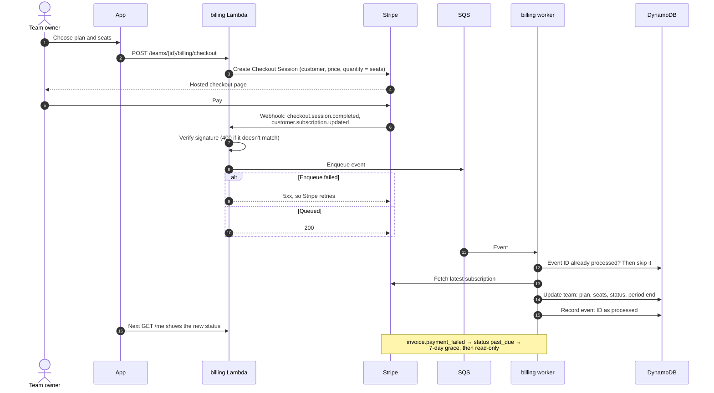

- **Order matters.** The webhook only verifies, enqueues and answers; it records nothing. The worker records the event ID only after the team is updated. Recording first could lose an event if the queue write or the worker then failed. If the worker fails after the update but before recording, the retry applies the same update again, which is harmless because the worker always applies the latest subscription it fetched from Stripe.
- **One subscription at a time.** Updates for one subscription are serialized, by an SQS FIFO message group per subscription or a conditional write on the event's creation time (bead `2kl` decides), so an older event can't overwrite a newer one.
- **Failures.** A message that keeps failing goes to a dead-letter queue, which alarms. A nightly job reconciles every team's entitlements with Stripe (bead `8jc.9`).
- Live updates carry products and sheets only, so the app sees a new plan or status on its next `GET /me`.

### 6a. Subscription and access states

From [ADR 0009](../adr/0009-billing-stripe.md) and bead `qdx`. Stripe's subscription status is stored on the team; the grace period and read-only mode are worked out from it and from how long the team has been in that status. New teams start as `trialing` today (PR #40); nothing enforces access by status yet.

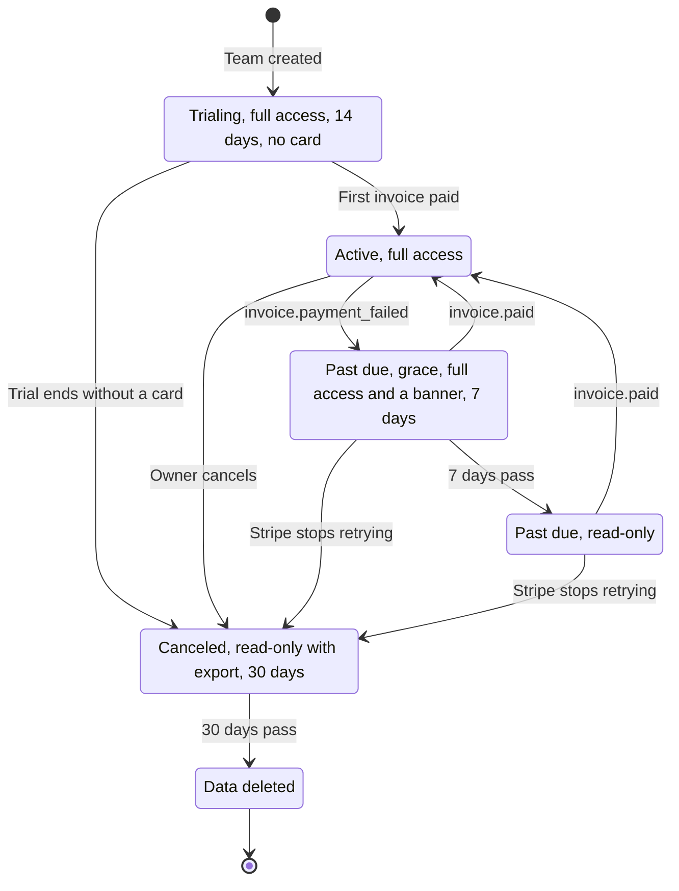

| Access | Stripe status |
| --- | --- |
| Full | `trialing`, `active`, and `past_due` for the first 7 days (with a banner) |
| Read-only | `past_due` after 7 days; `canceled` for 30 days, with export |
| None, data deleted | 30 days after `canceled`, as the privacy policy describes |

What happens when a trial ends without a card, and when Stripe stops retrying a failed payment, are Stripe settings chosen in beads `x0l` and `qdx`; the diagram shows the cancel option for both.

### 6b. Choosing a plan in the mobile app (phase 2)

**Phase 2.** The mobile apps aren't part of the MVP. Owners choose a plan in the iOS or Android app and pay on Stripe Checkout; there is no store in-app purchase ([ADR 0013](../adr/0013-web-billing-only.md)).

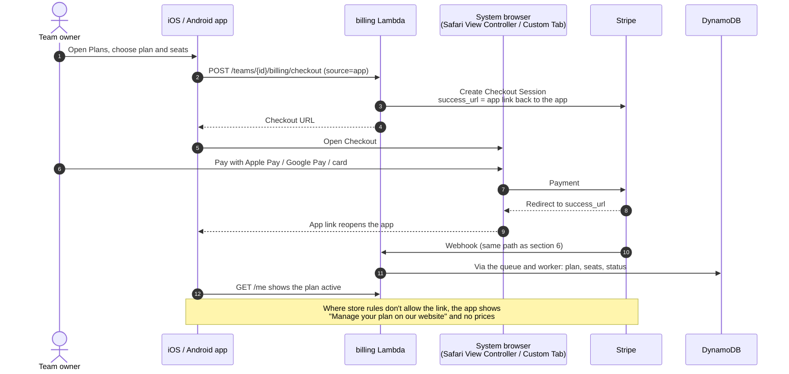

## 7. Sign-in and team access

Built: Cognito in PR #36, the JWT authorizer and data API in PR #37, and `GET /me` with team creation and invite acceptance in PR #40 ([docs/api/onboarding.md](../api/onboarding.md)).

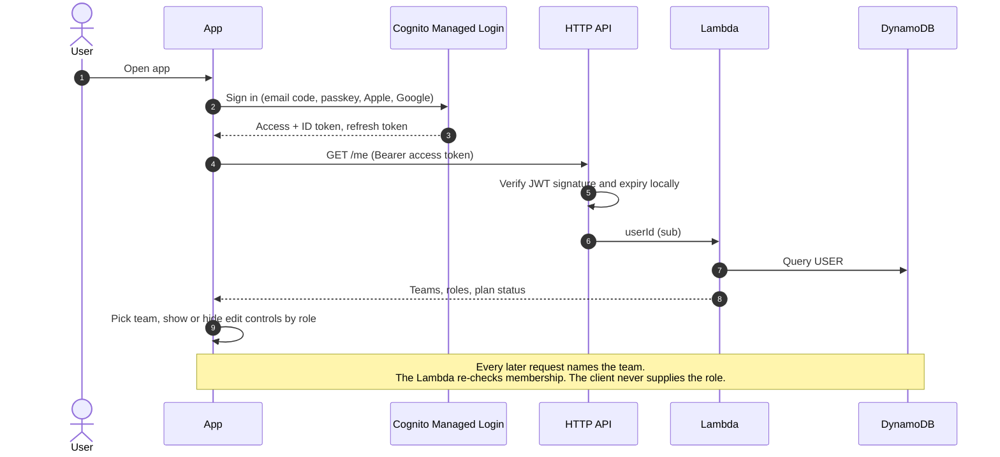

## 8. Data model

One DynamoDB table ([ADR 0005](../adr/0005-multi-tenant-dynamodb.md)). Everything a team owns shares the `TEAM#<teamId>` partition key. Built in PRs #24 and #26. The checkout, return and stock commands (section 4) add an operation record per command and an inventory movement record per stock change, in the team's partition.

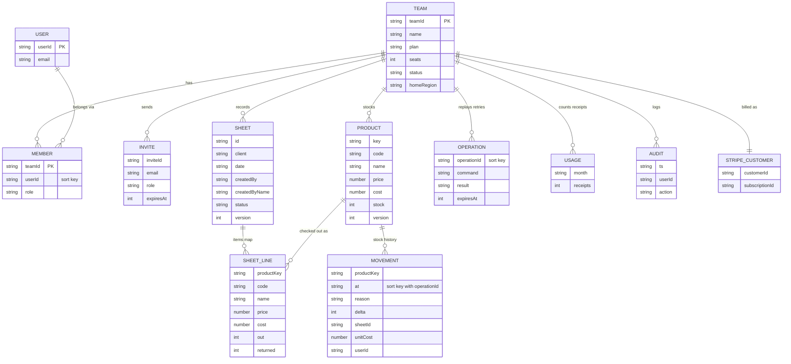

## 9. Delivery pipeline

From pull request to production, with automatic rollback ([ADR 0012](../adr/0012-cicd-releases-rollbacks.md)). Built today: the pull request gates (without the preview stack), release-please, and attaching `index.html` to each release. The deploys, canaries and rollback are planned.

```mermaid
flowchart LR
  pr[Pull request] --> gates[Lint, HTML validate, actionlint,<br/>unit + Playwright tests,<br/>cdk-nag, CodeQL, audit]
  gates --> preview[Preview stack in dev<br/>journey tests]
  preview --> merge[Squash-merge to main]
  merge --> build[Build once:<br/>web bundle, Lambda zips,<br/>CDK assembly]
  build --> stg[Deploy staging<br/>us-east-1]
  stg --> stgtest[Journey + smoke tests<br/>against staging]
  stgtest --> rp[release-please PR]
  rp -->|merge = tag vX.Y.Z| prode[Prod us-east-1<br/>Lambda canary 10% / 5 min]
  prode --> cane{Alarms + synthetics OK?}
  cane -->|no| rbe[Auto rollback:<br/>alias + web version]
  cane -->|yes| mobile[fastlane:<br/>TestFlight + Play internal]
  mobile --> art[Attach index.html<br/>for claude.ai artifact]
```

In phase 2, staging deploys to both regions, and prod deploys to us-west-2 first (with its own canary and rollback), then us-east-1. The mobile builds are also phase 2.

## Costs

The cost model is in [docs/business/cost-model.xlsx](../business/cost-model.xlsx), and the [business plan's unit economics section](../business/business-plan.md#6-unit-economics) summarizes it: fixed AWS cost per environment, margin per seat, and break-even. Receipt reading costs are in [ADR 0008](../adr/0008-receipt-reading-bedrock.md).
