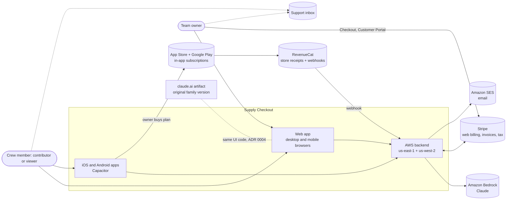
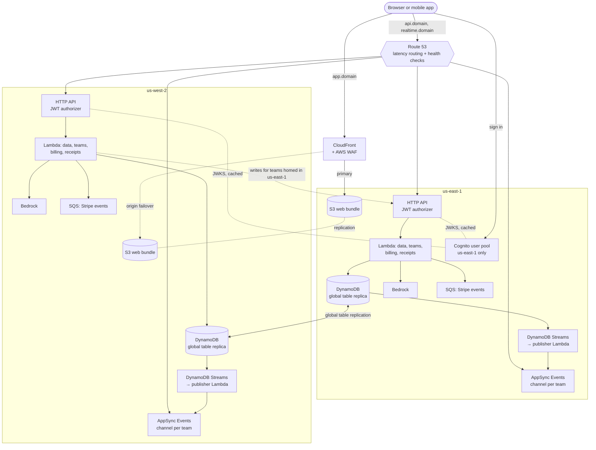
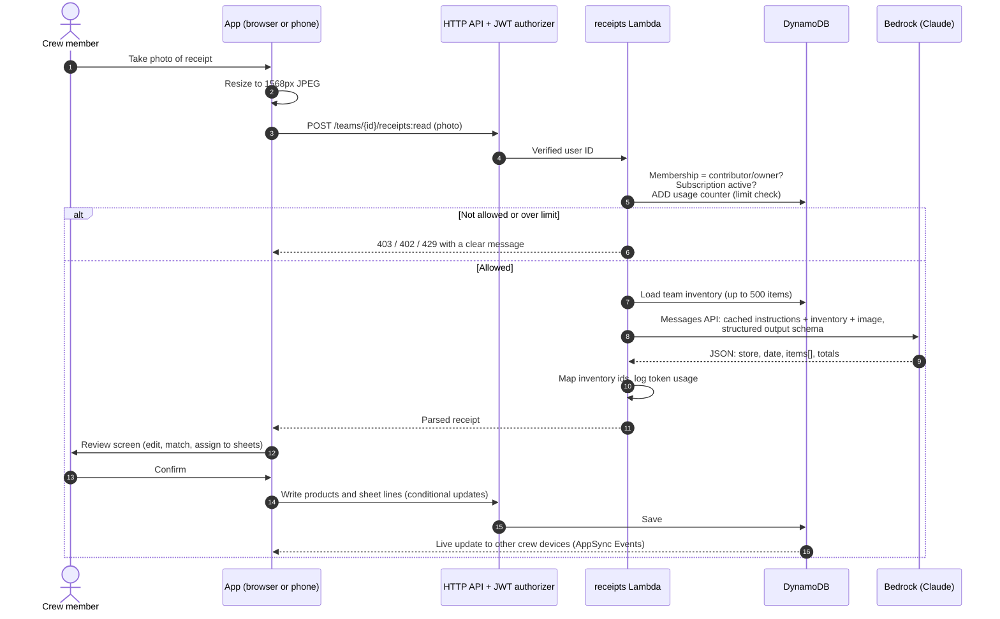
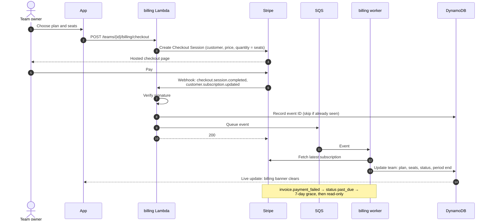
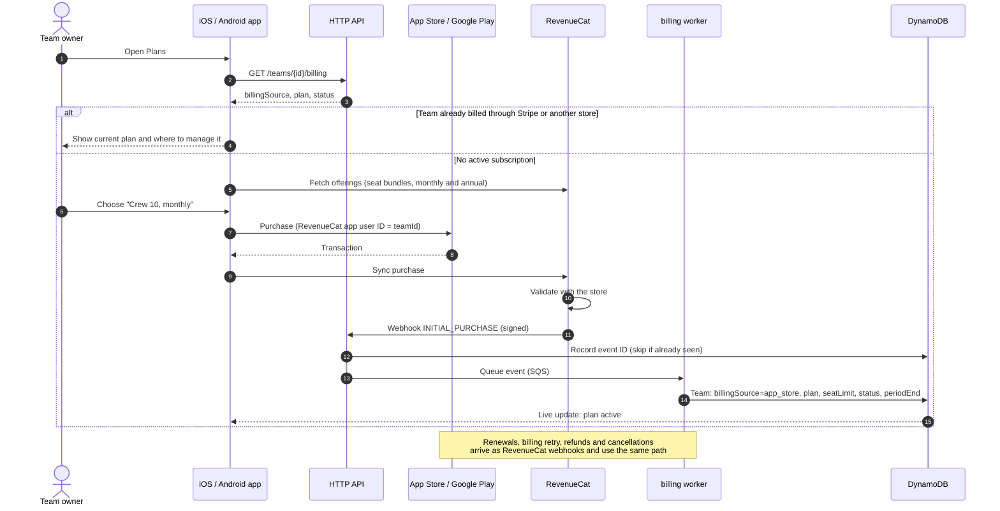
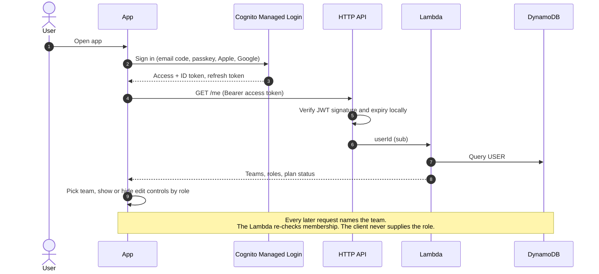
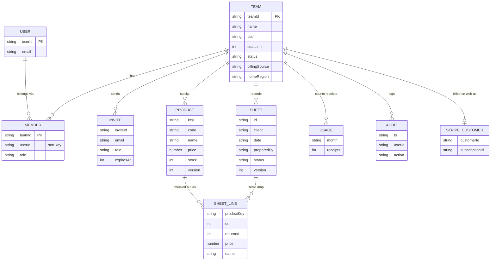

# Supply Checkout SaaS: architecture

This is the target design for running Supply Checkout as a paid, multi-tenant product on AWS at $3 per user per month. Each choice is explained in an [architecture decision record](../adr/README.md); the diagrams below show how the pieces fit together.

## 1. System context

Who and what the product talks to.

## 2. AWS deployment (active-active)

Both regions serve traffic. Each team has a home region for writes ([ADR 0010](../adr/0010-multi-region-active-active.md)).

Shared in both regions and not drawn: KMS keys, Secrets Manager replica secrets (Stripe keys), SES, CloudWatch alarms and dashboards, AWS Backup.

## 3. Reading a receipt

The flow from [ADR 0008](../adr/0008-receipt-reading-bedrock.md). Nothing is saved until the user confirms, just like today.

## 4. Billing and access

How Stripe events turn into access rules ([ADR 0009](../adr/0009-billing-stripe.md)).

## 4a. Subscribing in the mobile app

Owners can buy a seat-bundle plan in the iOS or Android app ([ADR 0013](../adr/0013-in-app-subscriptions.md)). Store and web purchases end up in the same team fields.

## 5. Sign-in and team access

## 6. Data model

One DynamoDB table ([ADR 0005](../adr/0005-multi-tenant-dynamodb.md)). Everything a team owns shares the `TEAM#<teamId>` partition key.

## 7. Delivery pipeline

From pull request to production, with automatic rollback ([ADR 0012](../adr/0012-cicd-releases-rollbacks.md)).

```mermaid
flowchart LR
  pr[Pull request] --> gates[Lint, HTML validate, actionlint,<br/>unit + Playwright tests,<br/>cdk-nag, CodeQL, audit]
  gates --> preview[Preview stack in dev<br/>journey tests]
  preview --> merge[Squash-merge to main]
  merge --> build[Build once:<br/>web bundle, Lambda zips,<br/>CDK assembly]
  build --> stg[Deploy staging<br/>both regions]
  stg --> stgtest[Journey + smoke tests<br/>against staging]
  stgtest --> rp[release-please PR]
  rp -->|merge = tag vX.Y.Z| prodw[Prod us-west-2<br/>Lambda canary 10% / 5 min]
  prodw --> canw{Alarms + synthetics OK?}
  canw -->|yes| prode[Prod us-east-1<br/>canary]
  canw -->|no| rbw[Auto rollback:<br/>alias + web version]
  prode --> cane{Alarms + synthetics OK?}
  cane -->|no| rbe[Auto rollback]
  cane -->|yes| mobile[fastlane:<br/>TestFlight + Play internal]
  mobile --> art[Attach index.html<br/>for claude.ai artifact]
```

## Costs at a glance

Rough monthly AWS cost for production **before** customers, both regions: Route 53 hosted zone and health checks (about $3), KMS keys (about $2–4), Secrets Manager (about $1–2), CloudWatch Synthetics canaries (about $5–10, the biggest fixed item), and WAF (about $6+). Everything else (Lambda, API Gateway, DynamoDB, AppSync Events, CloudFront, S3, Cognito, SES) is pay-per-use and costs pennies at low volume. Receipt reading is about half a cent to one and a half cents per receipt ([ADR 0008](../adr/0008-receipt-reading-bedrock.md)). Staging and dev add a similar but smaller fixed amount. The business plan bead turns this into a full cost model.
